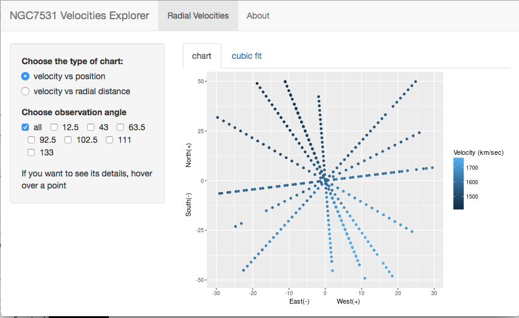

```{r setup, include=FALSE, echo=FALSE}
knitr::opts_chunk$set(echo = FALSE)
library(ElemStatLearn)
data(galaxy)
```

## NGC7531 Explorer

Presented here is a small Shiny app for exploring the "galaxy" dataset in the "ElemStatLearn" package of R. Please see the R Documentation page for "galaxy" for further information and references.

The running Shiny application can be seen at [WK4_Galaxy](https://sgillans.shinyapps.io/wk4_galaxy/).

The code can be found on [github.com](https://github.com/sgillans/dataproducts_wk4_assignment).

The following four slides show some aspects of the dataset and the app.

## Basic details of the "galaxy" dataset

```{r galaxy, echo = TRUE}
head(galaxy)
```

## Application adds a variable containing cube of radial position

```{r cube,echo = TRUE}
galaxy$rp3 <- galaxy$radial.position^3
```

This is used, for example, to fit a cubic to the velocity for an angle of observation:
```{r fit, echo=TRUE}
glx <- subset(galaxy,angle==12.5)
fit <- glm(velocity~rp3,data=glx)
coef(fit)
```
No claim is made as to the usefulness of the cubic fit.

## NGC7531 Explorer picture



